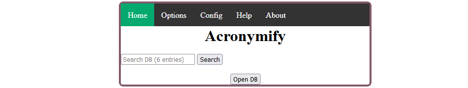

# Acronymify

Acronymify is a browser extension that enables you to define acronyms, recognize them on web pages, and display their definition.


## Installation

- For Firefox: download it from [AMO](https://addons.mozilla.org/addon/acronymify/).
- For other browsers:
    1. Download the zip release from the [Releases](https://github.com/l-dav/Acronymify/releases/tag/release_v1.0.2).
    2. Then:
        - Chrome: go to "chrome://extensions/". Toggle the "Developer mode" option. Drag-n-Drop the .zip.
        - Edge: go to "edge://extensions/". Toggle the "Developer mode" option. Drag-n-Drop the .zip.
        - Opera: go to "opera://extensions". Toggle the "Developer mode" option. Drag-n-Drop the .zip.
        - Safari: not yet ;)


## Usage



When you load Acronymify for the first time, you will be guide to build your local database.

Then, click on a word on any web page, and activate the extension by using the shortcut or clicking the extension logo. If the word's definition is known, it will be displayed.


### Use an online source

From the config tab, you can link an online JSON dataset.

The online database must follow the following JSON format:
```json
{
    "entries": [
        {
            "Acronym": "acronym",
            "Meaning": "meaning",
            "Hint": "hint",
            "Alternatives": "alternatives",
            "url": "url"
        }, {
            "Acronym": "acronym",
            "Meaning": "meaning",
            "Hint": "hint",
            "Alternatives": "alternatives",
            "url": "url"
        }
    ]
}
```

### Add custom entries

You can specified your own custom entries

The configuration must follow the following JSON format:
```json
{
    "acronyms_source": "https://url_to_online_db.com",
    "url_add": "https://url_to_db_repository.com",
    "mail_add": "source@mail.com",
    "custom_entries": [
        {
            "Acronym": "your_acronym",
            "Meaning": "your_full_meaning",
            "Hint": "your_definition",
            "Alternatives": "your_alternatives",
            "url": "your_url"
        }
    ]
}
```

## Documentation

Acronymify is a Firefox extension.


### Overview

The source code is in the folder `./src/`. It contains a file "manifest.json" containing metadata about the extension, as specified in [Mozilla Documentation](https://developer.mozilla.org/en-US/docs/Mozilla/Add-ons/WebExtensions/manifest.json).


### Build, Sign, Publish

The Makefile allows you to build, sign, publish the extension.

To build the extension (generate an unsigned local .xpi archive ; for testing purposes):
> make build

To sign the extension and generate the .xpi archive (no public listing ; for testing purposes):
> make sign

To sign the extension, generate the .xpi archive and list the new version on AMO:
> make sign CHANNEL=listed


### Code algorithm

The popup is design in plain HTML/CSS, and all interactions are written in plain JavaScript.

Each time the extension popup is open, it is reload.

We start by displaying dynamic informations from the file "manifest.json": version, author, keyboard shortcut.

Then we check the local storage:
- if a local configuration is stored, it is loaded
- if not, then we load a default configuration

Then, we update the page with this informations: url_add, mailto, case sensitive option, ...

We add click listener to several events:
- Reset button: on click on it, we clear the local storage and reload the extension. It will be clean as a new installation.
- Case sensitive checkbox
- Fetching button: to download an online database.
- Refresh button: reload the extension
